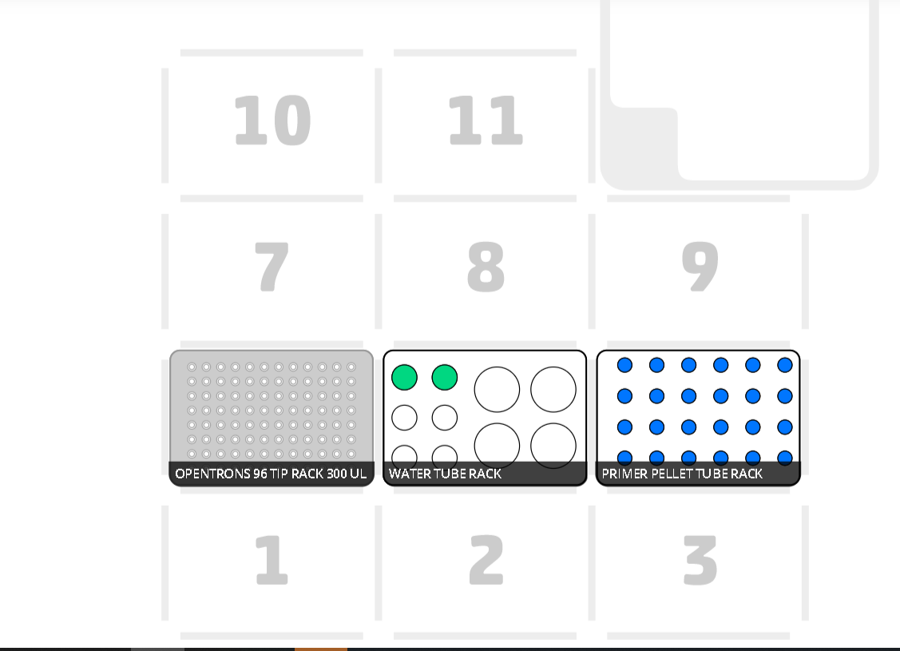
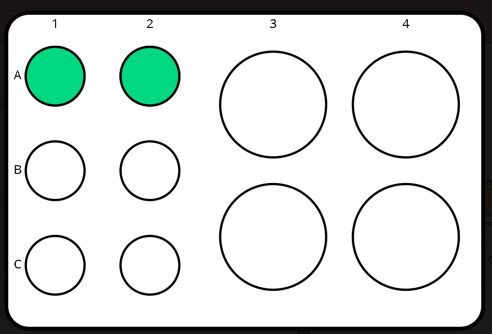

# Protocol Title (should match metadata of .py file)

### Author
[REM Analytics](https://www.remanalytics.ch/)

## Categories
* PCR Prep
	* Primer hydration

## Description
The goal of this protocol is to hydrate dry pellets of primers using water or tris-edta buffer. The user should provide the desired transfer volumes and well coordinates in a csv file. 

This protocol uses a multi-channel 300uL pipette as a single-channel pipette, which makes it necessary to place all the equipment in the middle row of the deck. 

Explanation of complex parameters below:
* `input .csv file`: Here, you should upload a .csv file formatted in the following way, being sure to include the header line:
```
source,dest,vol
A1,B1,4
```
The volume of each row can be above 300uL, but be careful not to surpass 5000uL for a single falcon tube. If you need to transfer more than 5000uL, ensure you add more falcon tubes and update the 'source' value in the csv

---


### Labware

* [Opentrons 10 Tube Rack with Falcon 4x50 mL, 6x15 mL Conical](https://labware.opentrons.com/opentrons_10_tuberack_falcon_4x50ml_6x15ml_conical)
* [Opentrons 24 Well Aluminum Block with Generic 2 mL Screwcap](https://labware.opentrons.com/opentrons_24_aluminumblock_generic_2ml_screwcap)
* 

### Pipettes
* [P300 8-Channel Electronic Pipette (GEN2)](https://shop.opentrons.com/collections/ot-2-pipettes/products/8-channel-electronic-pipette?variant=5984202489885)
* Nick is working on auto-filling these sections from the protocol (3/28/2021)

### Reagents
* Water or Tris-EDTA buffer in 15mL falcon tubes
* Dry primer pellets in 2mL tubes
---

### Deck Setup
* To start the protocol, it is necessary to use the middle row to avoid any damage to the pipette. The water 15mL falcon tubes will be placed in the middle slot, and the primer pellet 2mL screw cap tubes will be placed in the right slot.



### Reagent Setup
* You must ensure that there is at least 15mL of water in the falcon tubes to ensure the pipette can aspirate. Also ensure that in the csv you are not transferring more than 5mL per falcon tube. If you need to transfer more than 5mL, you need to add more falcon tubes and modify your csv. 
* Reservoir 1: slot 5

* Reservoir 2: slot 2  


---

### Protocol Steps
1. This section should consist of a numerical outline of the protocol steps, somewhat analogous to the steps outlined by the user in their custom protocol submission.
2. example step: Samples are transferred from the source tuberacks on slots 1-2 to the PCR plate on slot 3, down columns and then across rows.
3. example step: Waste is removed from each sample on the magnetic module, ensuring the bead pellets are not contacted by the pipette tips.

### Process
1. Input your protocol csv file above.
2. Download your protocol and unzip if needed.
3. Upload your protocol file (.py extension) to the [OT App](https://opentrons.com/ot-app) in the `Protocol` tab.
4. Set up your deck according to the deck map.
5. Calibrate your labware, tiprack and pipette using the OT App. For calibration tips, check out our [support articles](https://support.opentrons.com/en/collections/1559720-guide-for-getting-started-with-the-ot-2).
6. Hit 'Run'.

###### Internal
protocol-hex-code
